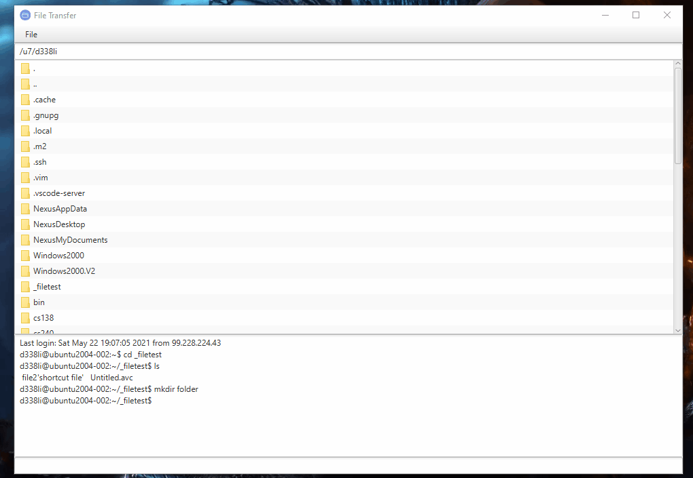
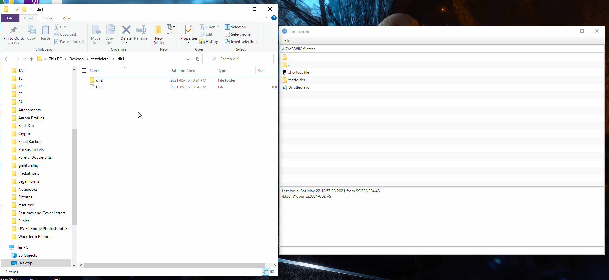
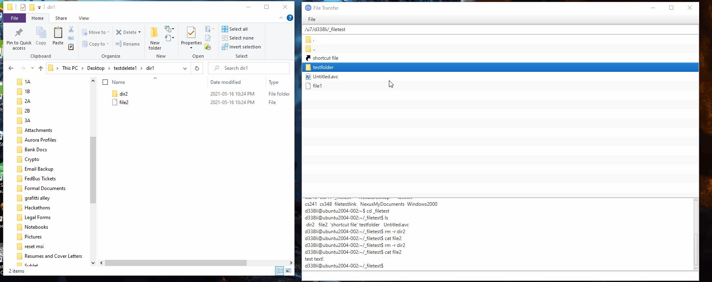
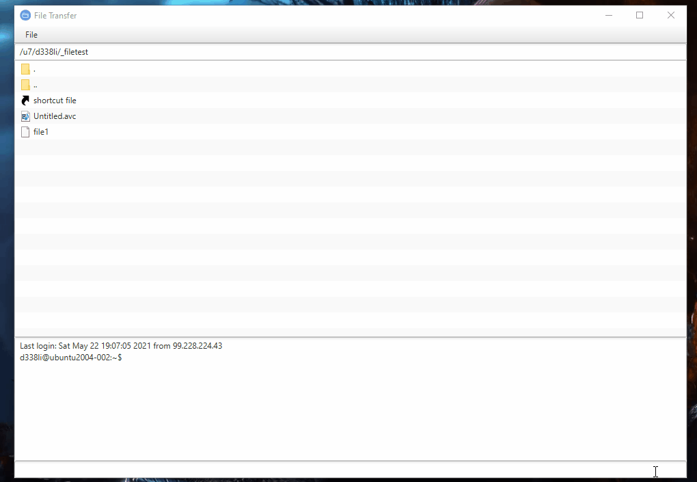
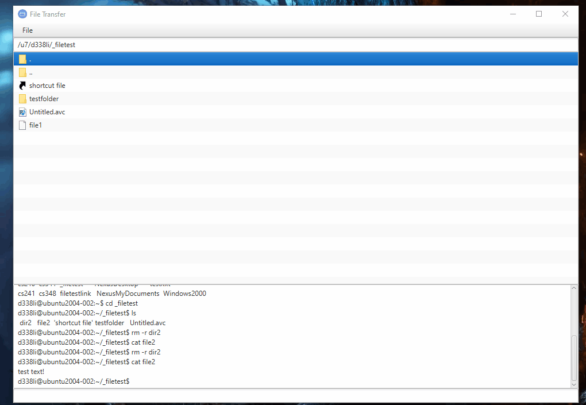
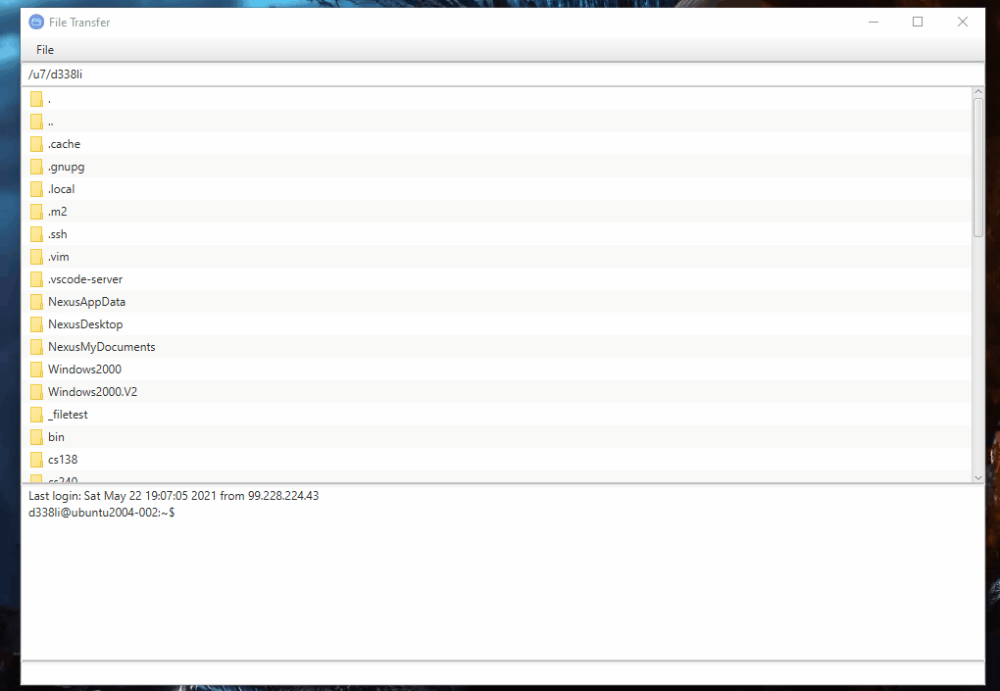
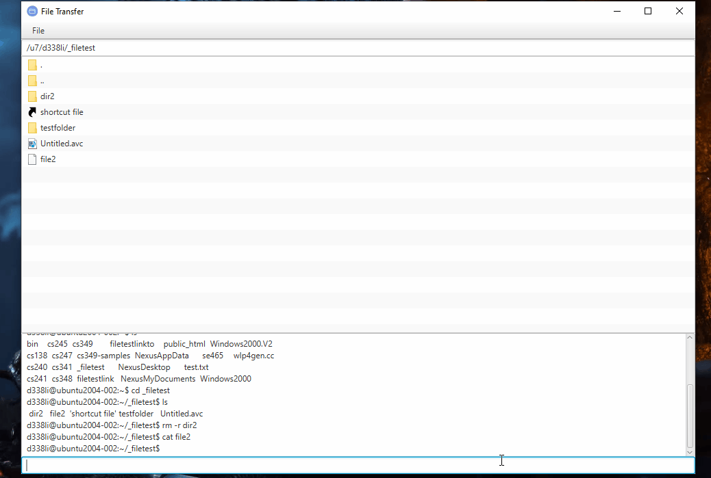

# FileTransfer

A remote server file explorer that supports
- Navigating, renaming, and deleting files
- Opening and editing files (auto update to server)
- Drag and Drop To and From Local Explorer

Login Screen:

Folder Navigation (Double Click/Enter):

Open files locally and automatically update to Server: 

Drag and Drop from Local Explorer to Server:

Drag and Drop from Server to Local Explorer:

Renaming File (F2):

Deleting File (Del):

Change Directory using Directory Bar:

Terminal:

The current behaviour is to overwrite all files for any operation.
Please use the tool at your own risk. I am not responsible for any damages that may occur when using this tool.

Shortcut Icon:
https://static.thenounproject.com/png/258144-200.png

Application Icon:
https://www.klipfolio.com/sites/default/files/integrations/ftp-sftp_0.png
